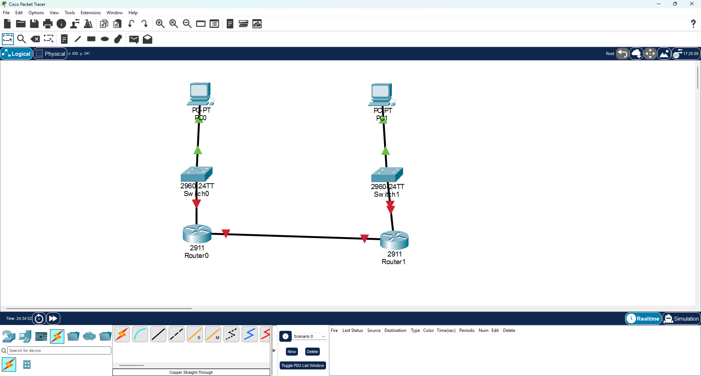
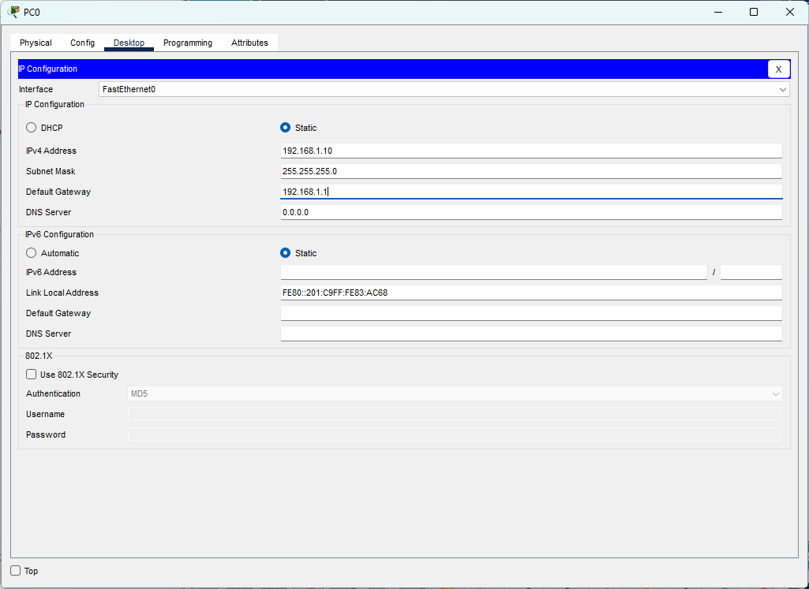
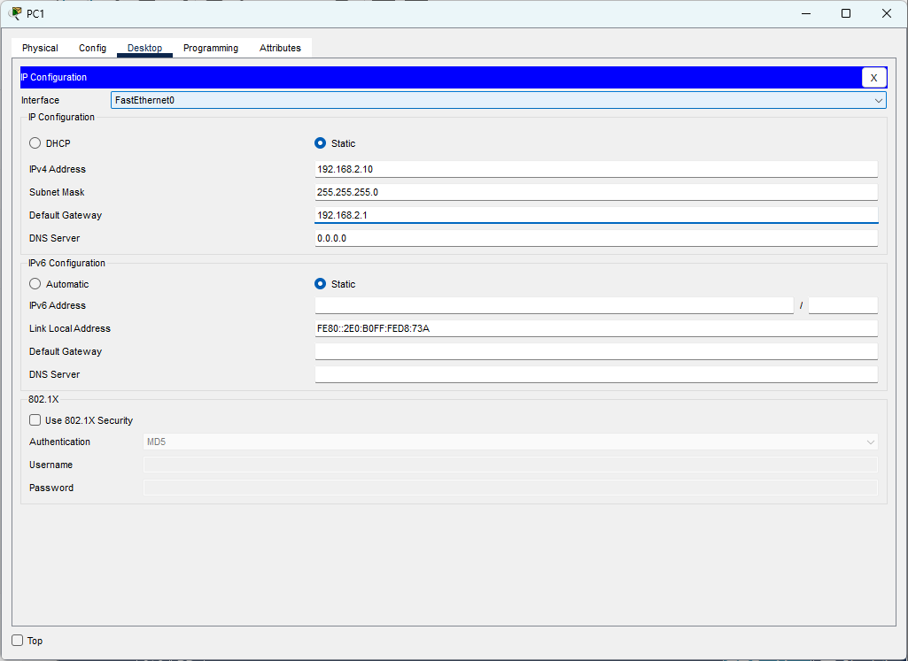
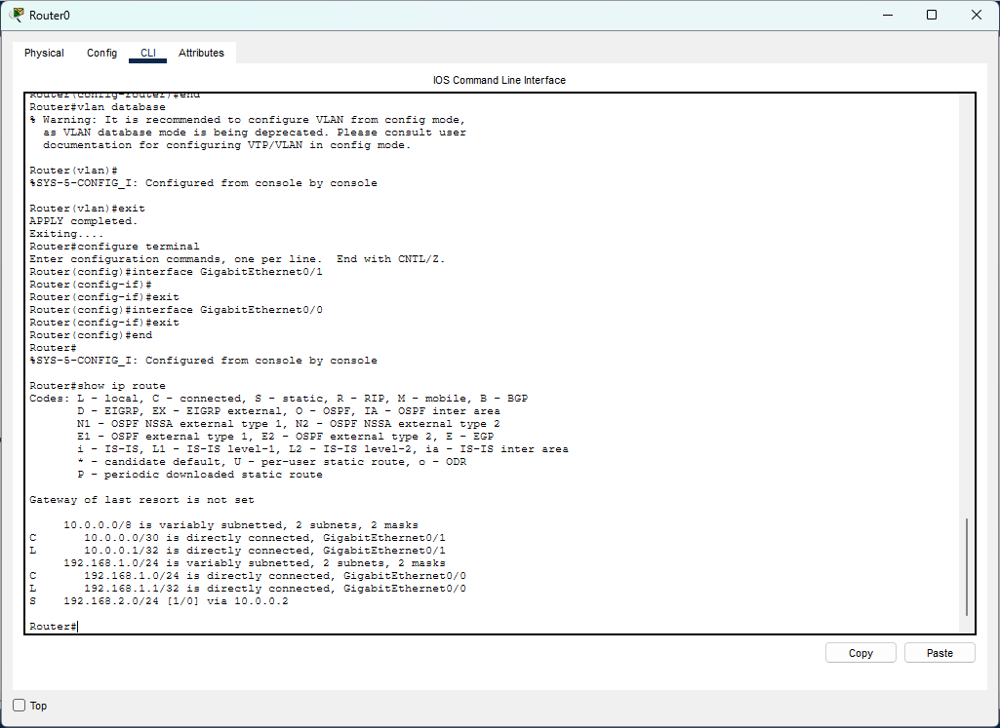
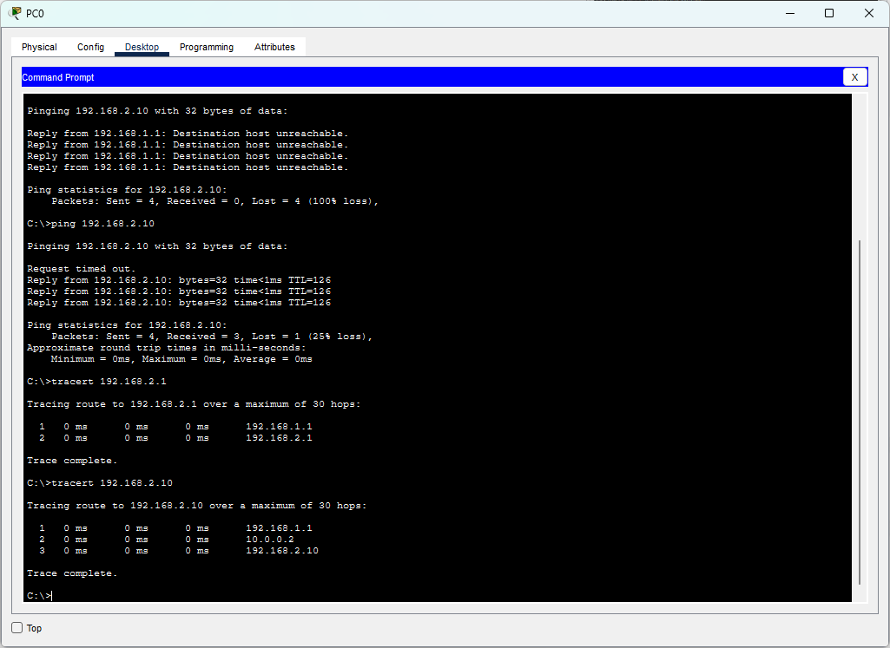

# CCNA Lab 04 — Static Routing

## 📌 Lab Overview

This lab was performed using **Cisco Packet Tracer** to understand how **Static Routing** enables communication between devices located in different networks.

The network consists of two LANs connected through two routers.

* PC0 is located in the `192.168.1.0/24` network.
* PC1 is located in the `192.168.2.0/24` network.
* Router0 and Router1 are connected through the `10.0.0.0/30` network.

Initially, PC0 was unable to communicate with PC1 because the routers did not have routes to the remote networks.

Static routes were then configured manually on both routers, allowing end-to-end communication between the two networks.

---

## 🎯 Objectives

* Configure IPv4 addressing on PCs and router interfaces
* Establish connectivity between two routers
* Understand directly connected and remote networks
* Configure Static Routes manually
* Configure a return path for two-way communication
* Understand the Next-Hop IP address
* Verify routing using `show ip route`
* Test end-to-end connectivity using `ping`
* Verify the packet path using `tracert`

---

## 🖥️ Network Topology

```text
PC0
 |
 | 192.168.1.0/24
 |
Switch0
 |
Router0
 | G0/1
 | 10.0.0.1
 |
 | 10.0.0.0/30
 |
 | 10.0.0.2
 | G0/1
Router1
 |
Switch1
 |
 | 192.168.2.0/24
 |
PC1
```



---

## 🌐 IP Addressing

| Device  | Interface          | IP Address   | Subnet Mask     | Default Gateway |
| ------- | ------------------ | ------------ | --------------- | --------------- |
| PC0     | FastEthernet0      | 192.168.1.10 | 255.255.255.0   | 192.168.1.1     |
| Router0 | GigabitEthernet0/0 | 192.168.1.1  | 255.255.255.0   | —               |
| Router0 | GigabitEthernet0/1 | 10.0.0.1     | 255.255.255.252 | —               |
| Router1 | GigabitEthernet0/1 | 10.0.0.2     | 255.255.255.252 | —               |
| Router1 | GigabitEthernet0/0 | 192.168.2.1  | 255.255.255.0   | —               |
| PC1     | FastEthernet0      | 192.168.2.10 | 255.255.255.0   | 192.168.2.1     |

### PC0 Configuration



### PC1 Configuration



---

## 🔌 Router-to-Router Connectivity

The routers were connected using the `10.0.0.0/30` network.

```text
Router0 G0/1 → 10.0.0.1/30
Router1 G0/1 → 10.0.0.2/30
```

Connectivity between the routers was verified successfully using `ping`.

```text
Router0 → ping 10.0.0.2
Router1 → ping 10.0.0.1
```

---

## 🚫 Connectivity Before Static Routing

Before configuring Static Routes, PC0 attempted to communicate with PC1:

```text
ping 192.168.2.10
```

The communication failed because Router0 did not have a route to the remote network:

```text
192.168.2.0/24
```

Similarly, Router1 required a route back to:

```text
192.168.1.0/24
```

This demonstrated the need for both a forward path and a return path.

---

## 🛣️ Static Route Configuration

### Router0

Router0 was configured with a Static Route to reach the `192.168.2.0/24` network through Router1.

```text
ip route 192.168.2.0 255.255.255.0 10.0.0.2
```

Where:

```text
Destination Network: 192.168.2.0/24
Next-Hop IP: 10.0.0.2
```

### Router1

Router1 was configured with a return route to reach the `192.168.1.0/24` network through Router0.

```text
ip route 192.168.1.0 255.255.255.0 10.0.0.1
```

Where:

```text
Destination Network: 192.168.1.0/24
Next-Hop IP: 10.0.0.1
```

---

## 📋 Routing Table Verification

The routing table was verified using:

```text
show ip route
```

### Router0

The routing table confirmed:

```text
C 192.168.1.0/24
C 10.0.0.0/30
S 192.168.2.0/24 via 10.0.0.2
```



The `S` indicates a manually configured **Static Route**.

---

## 🧪 End-to-End Connectivity Verification

After configuring Static Routes on both routers, PC0 successfully communicated with PC1.

```text
ping 192.168.2.10
```

The successful replies confirmed that Static Routing was working correctly between the two networks.

---

## 🛣️ Packet Path Verification

The packet path was verified from PC0 using:

```text
tracert 192.168.2.10
```

The result showed the following path:

```text
PC0
192.168.1.10
      |
      v
Router0
192.168.1.1
      |
      v
Router1
10.0.0.2
      |
      v
PC1
192.168.2.10
```

This confirmed that traffic was routed through both routers before reaching the destination.



---

## 📸 Lab Evidence

All practical screenshots are stored in the `Screenshot/` directory.

1. **01-network-topology.png** — Complete network topology
2. **02-pc0-ip-configuration.png** — PC0 IPv4 configuration
3. **03-pc1-ip-configuration.png** — PC1 IPv4 configuration
4. **04-router0-routing-table.png** — Static Route verification using `show ip route`
5. **05-static-routing-connectivity-verification.png** — End-to-end connectivity and packet path verification

---

## 🧠 Key Concepts Learned

* Routing
* Routing Table
* Directly Connected Network
* Remote Network
* Static Routing
* Next-Hop IP Address
* Forward Path
* Return Path
* IPv4 Addressing
* Default Gateway
* `/30` Point-to-Point Network
* `show ip route`
* ICMP Ping
* Traceroute

---

## 🛠️ Software Used

* Cisco Packet Tracer

---

## 📁 Lab Files

```text
Lab-04-Static-Routing/
│
├── Static routing.pkt
├── README.md
│
└── Screenshot/
    ├── 01-network-topology.png
    ├── 02-pc0-ip-configuration.png
    ├── 03-pc1-ip-configuration.png
    ├── 04-router0-routing-table.png
    └── 05-static-routing-connectivity-verification.png
```

---

## ✅ Lab Result

The lab successfully demonstrated **Static Routing between two different networks**.

The practical verified:

* IPv4 addressing
* Router interface configuration
* Router-to-Router connectivity
* Directly connected networks
* Remote networks
* Static Route configuration
* Next-Hop IP operation
* Forward and Return Path configuration
* Routing table verification
* Successful end-to-end connectivity
* Packet path verification using `tracert`

---

## 👤 Author

**Sagen Saren**
