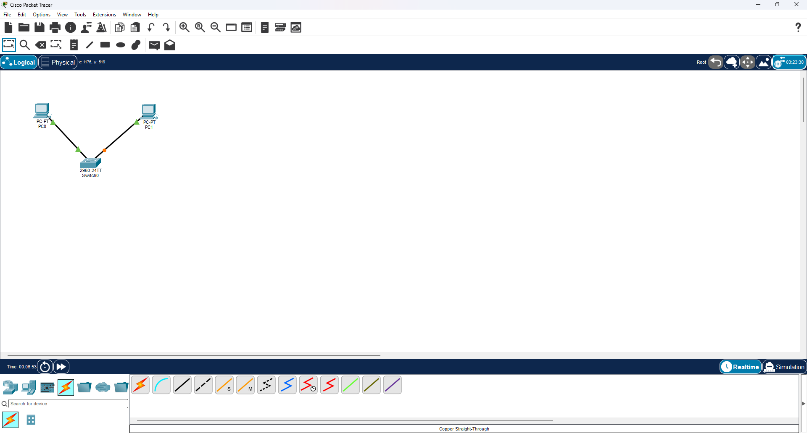
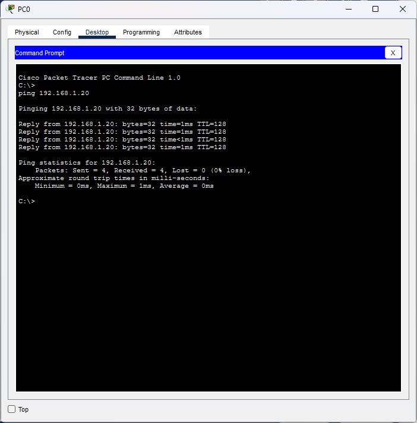
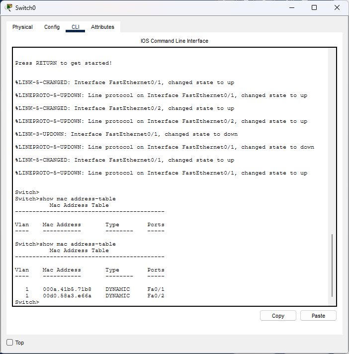
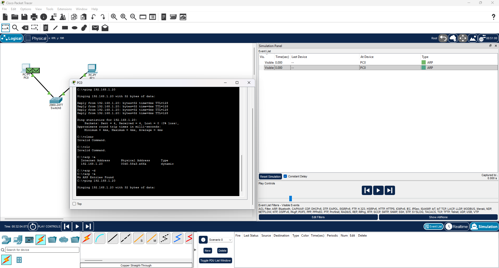
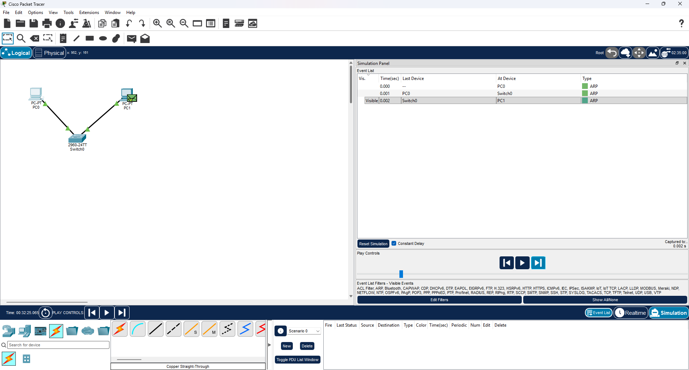

# CCNA Lab 01 — Basic LAN, MAC Learning & ARP Flooding

## 📌 Lab Overview

This lab was performed using **Cisco Packet Tracer** to understand the fundamentals of LAN communication, Ethernet switching, MAC address learning, ARP, and flooding.

## 🎯 Objectives

* Build a basic LAN using two PCs and a Cisco 2960 switch
* Configure IPv4 addresses
* Test connectivity using `ping`
* Observe the switch MAC address table
* Understand dynamic MAC address learning
* Clear and inspect the ARP cache
* Observe ARP broadcast flooding using Packet Tracer Simulation Mode

---

## 🖥️ Network Topology

```text
PC0 ───────── Switch0 ───────── PC1
             Cisco 2960
```

### Devices

| Device                        | Quantity |
| ----------------------------- | -------: |
| PC                            |        2 |
| Cisco 2960 Switch             |        1 |
| Copper Straight-Through Cable |        2 |

### Port Connections

```text
PC0 FastEthernet0 → Switch Fa0/1
PC1 FastEthernet0 → Switch Fa0/2
```

---

## 🌐 IP Address Configuration

### PC0

```text
IP Address  : 192.168.1.10
Subnet Mask : 255.255.255.0
```

### PC1

```text
IP Address  : 192.168.1.20
Subnet Mask : 255.255.255.0
```

Default Gateway was left blank because both PCs belong to the same network and no router is used in this lab.

---

## 🧪 1. Connectivity Test

From PC0, the following command was executed:

```bash
ping 192.168.1.20
```

### Result

```text
Packets: Sent = 4
Received = 4
Lost = 0 (0% loss)
```

The successful ping confirms that PC0 and PC1 can communicate through the switch.

---

## 🔍 2. MAC Address Learning

The switch MAC address table was checked using:

```text
show mac address-table
```

The switch learned the connected devices dynamically.

Example:

```text
MAC Address       Type       Port
000a.41b5.71b8    DYNAMIC    Fa0/1
00d0.58a3.e66a    DYNAMIC    Fa0/2
```

This demonstrates that the switch learned:

```text
PC0 MAC → Fa0/1
PC1 MAC → Fa0/2
```

### Key Concept

A switch learns the **Source MAC Address** of incoming Ethernet frames and associates it with the incoming port.

> Source MAC → Learn
> Destination MAC → Forward

---

## 🔬 3. ARP Cache

The ARP table of PC0 was checked using:

```bash
arp -a
```

After clearing the ARP cache:

```bash
arp -d
```

the result was:

```text
No ARP Entries Found
```

This confirmed that PC0 did not have a cached MAC address for PC1 at that point.

---

## 📡 4. ARP Request & Flooding

After clearing the ARP cache, PC0 attempted to communicate with PC1:

```bash
ping 192.168.1.20
```

Packet Tracer was switched to **Simulation Mode**, with the ARP filter enabled.

The ARP events showed:

```text
PC0 → Switch0 → PC1
```

The switch forwarded the ARP request toward PC1.

### Why did this happen?

PC0 knew PC1's IP address:

```text
192.168.1.20
```

but did not initially know PC1's MAC address.

Therefore, PC0 generated an **ARP Request**.

ARP Request is a broadcast, so the switch forwards the broadcast frame out the relevant ports except the port on which it was received.

This behaviour is called **flooding**.

---

## 🧠 Key Concepts Learned

### Switch

A Layer 2 switch uses MAC addresses to forward Ethernet frames.

### MAC Address Table

The switch maintains a mapping:

```text
MAC Address → Switch Port
```

### Dynamic MAC Learning

The switch learns MAC addresses automatically from the source MAC address of incoming frames.

### ARP

ARP is used to discover the MAC address associated with an IPv4 address on the local network.

```text
IPv4 Address → MAC Address
```

### Flooding

A switch may flood:

* Broadcast frames
* Unknown-unicast frames

### Important Rule

```text
Known Destination MAC
        ↓
Forward to specific port

Unknown Destination MAC / Broadcast
        ↓
Flood
```

---

## 💻 Commands Used

### PC

```bash
ping 192.168.1.20
```

Tests IP connectivity.

```bash
arp -a
```

Displays the ARP cache.

```bash
arp -d
```

Clears the ARP cache.

### Switch

```text
show mac address-table
```

Displays the switch MAC address table.

---

## 📸 Lab Evidence

### 1. Network Topology


### 2. Successful Ping Test


### 3. Switch MAC Address Table


### 4. Empty ARP Table


### 5. ARP Flooding in Simulation Mode


---

## ✅ Lab Result

The lab successfully demonstrated:

* Basic LAN connectivity
* IPv4 addressing
* Switch port connectivity
* MAC address learning
* Dynamic MAC address table
* ARP operation
* ARP broadcast
* Flooding behaviour
* Basic Packet Tracer Simulation Mode

---

## 📚 Skills Practiced

`Networking Fundamentals` `IPv4` `Ethernet` `MAC Address` `Switching` `ARP` `Broadcast` `Flooding` `Cisco Packet Tracer`

---

---

## 👤 Author

**Sagen**

CCNA Networking Labs & Practical Documentation
