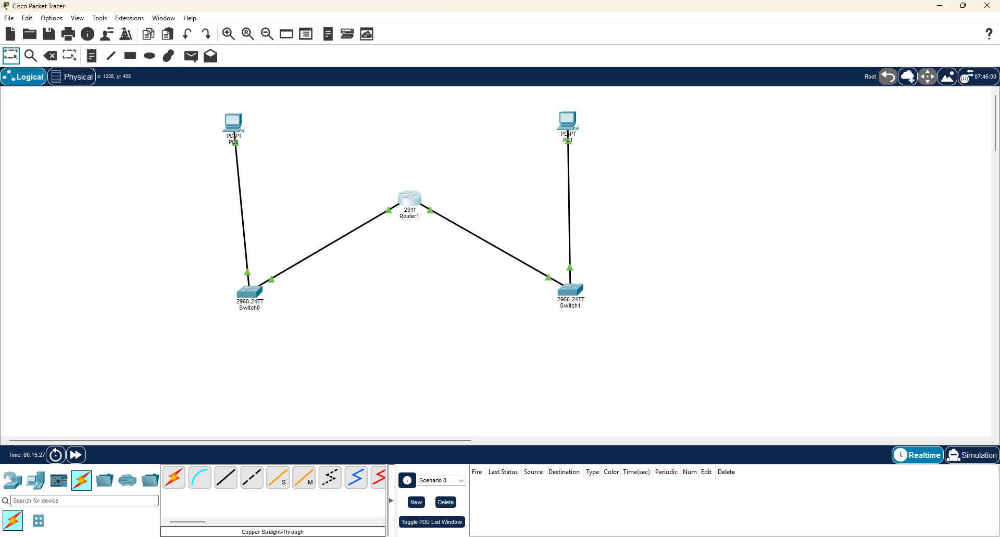
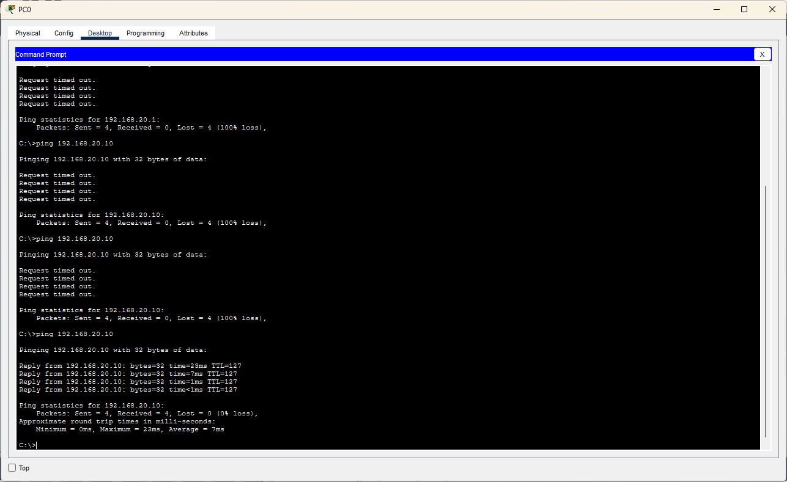
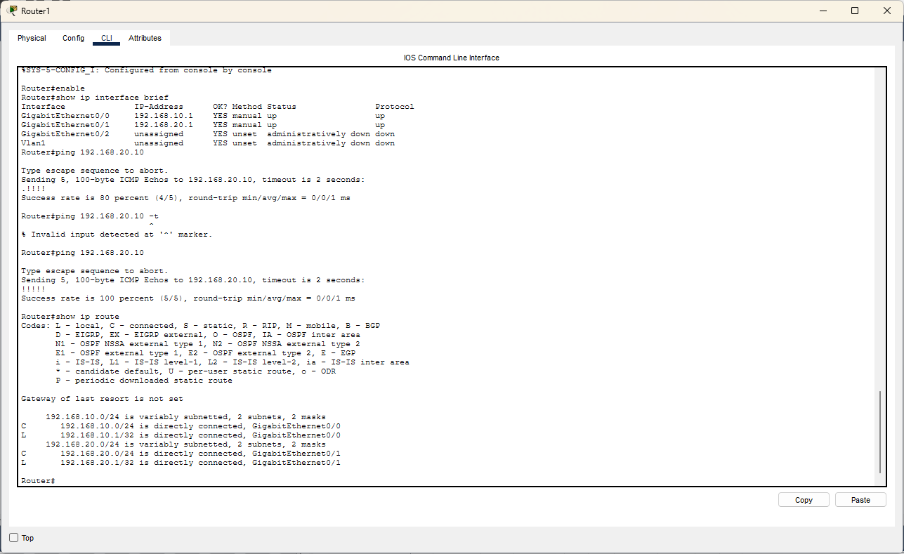
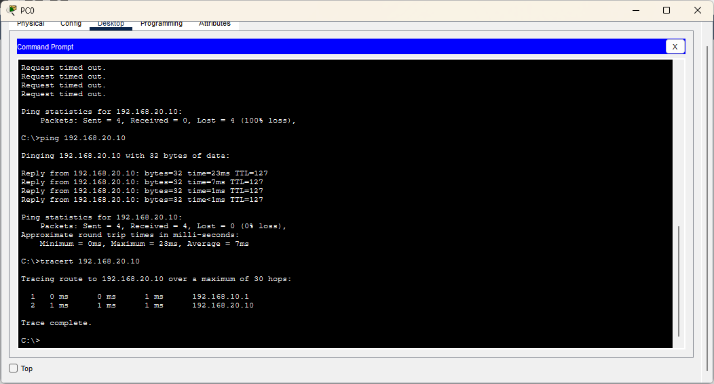
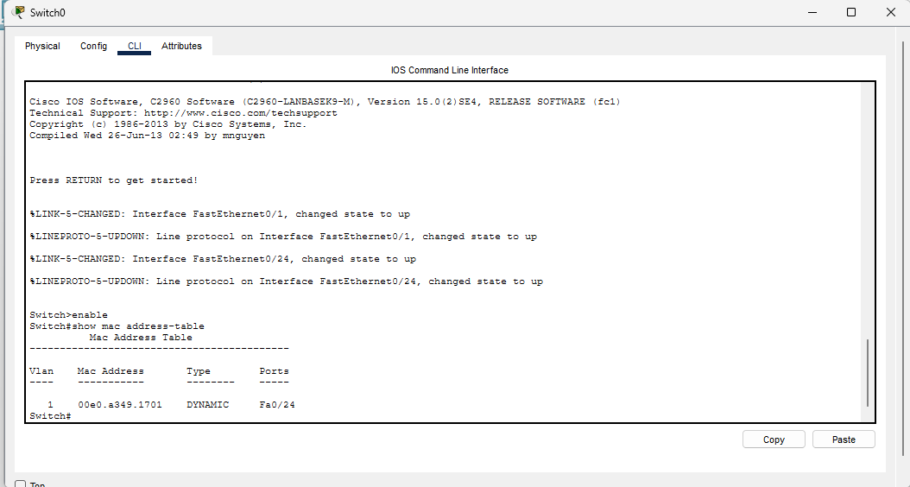
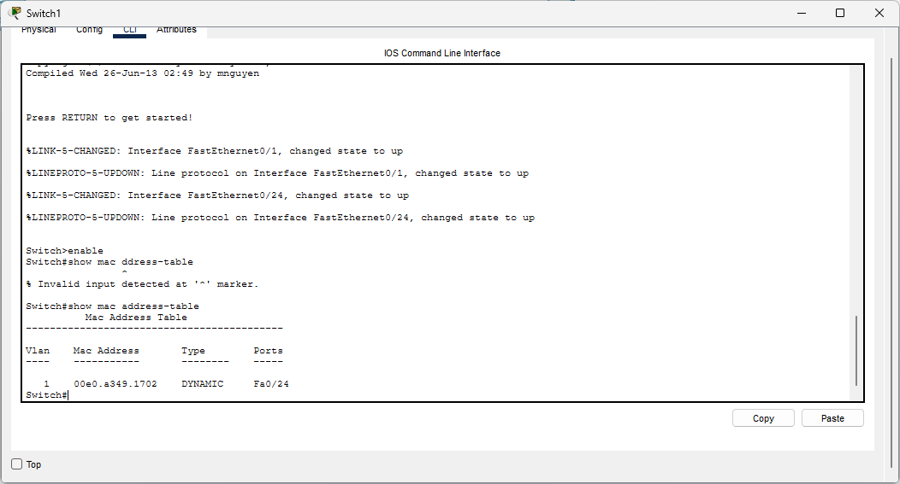
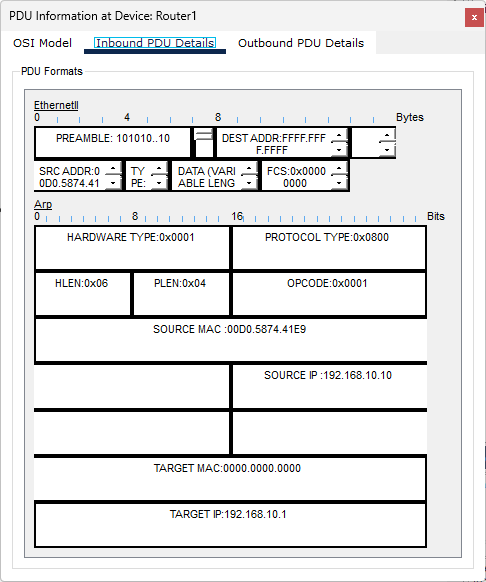
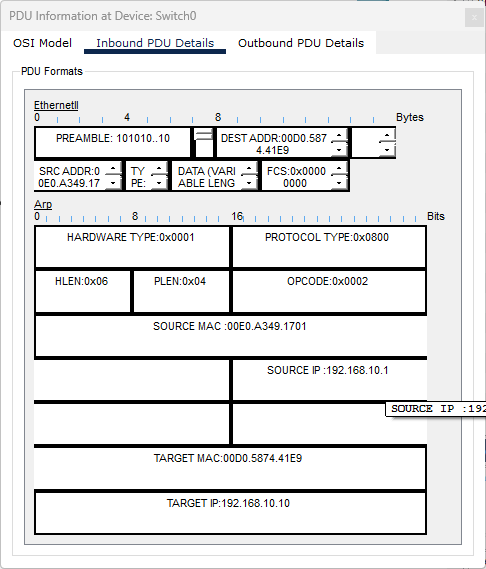

# CCNA Lab 02 — Inter-Network Routing, MAC Learning \& ARP

## 📌 Lab Overview

This lab was performed using **Cisco Packet Tracer** to understand communication between two different IPv4 networks using a Cisco router.

The lab also demonstrates router interface configuration, Default Gateway operation, IP routing, switch MAC address learning, ARP cache behavior, and ARP Request/Reply using Packet Tracer Simulation Mode.

\---

## 🎯 Objectives

* Connect two different LANs using a Cisco router
* Configure IPv4 addresses on PCs and router interfaces
* Configure Default Gateway
* Verify inter-network connectivity using `ping`
* Verify the packet path using `tracert`
* Inspect the router's routing table
* Observe dynamic MAC address learning on switches
* Clear and inspect the ARP cache
* Observe ARP Request and ARP Reply

\---

## 🖥️ Network Topology

```text
PC0 ── Switch0 ── Router1 ── Switch1 ── PC1
```

### Devices

|Device|Quantity|
|-|-:|
|PC|2|
|Cisco 2960 Switch|2|
|Cisco 2911 Router|1|

\---

## 🌐 IP Addressing

### Network 1

**Network:** `192.168.10.0/24`

|Device|Interface|IP Address|Subnet Mask|
|-|-|-|-|
|PC0|FastEthernet0|192.168.10.10|255.255.255.0|
|Router1|GigabitEthernet0/0|192.168.10.1|255.255.255.0|

**PC0 Default Gateway:** `192.168.10.1`

### Network 2

**Network:** `192.168.20.0/24`

|Device|Interface|IP Address|Subnet Mask|
|-|-|-|-|
|Router1|GigabitEthernet0/1|192.168.20.1|255.255.255.0|
|PC1|FastEthernet0|192.168.20.10|255.255.255.0|

**PC1 Default Gateway:** `192.168.20.1`

\---

## 🔌 Router Interface Configuration

Router1 was configured with two Gigabit Ethernet interfaces.

### GigabitEthernet0/0

```text
interface gigabitEthernet 0/0
ip address 192.168.10.1 255.255.255.0
no shutdown
```

### GigabitEthernet0/1

```text
interface gigabitEthernet 0/1
ip address 192.168.20.1 255.255.255.0
no shutdown
```

The interface status was verified using:

```text
show ip interface brief
```

Both interfaces were successfully shown as **up/up**.

\---

## 🧪 Connectivity Test

Connectivity between PC0 and PC1 was tested using:

```text
ping 192.168.20.10
```

The final test was successful:

```text
Packets: Sent = 4
Received = 4
Lost = 0 (0% loss)
```

This confirms successful communication between the two different IPv4 networks.

\---

## 🛣️ Path Verification

The path from PC0 to PC1 was verified using:

```text
tracert 192.168.20.10
```

The packet travelled through the router:

```text
PC0
 ↓
192.168.10.1
 ↓
192.168.20.10
 ↓
PC1
```

This demonstrates that Router1 is forwarding traffic between the two networks.

\---

## 📋 Routing Table

The router's routing table was checked using:

```text
show ip route
```

The router learned both networks as directly connected:

```text
192.168.10.0/24 → GigabitEthernet0/0
192.168.20.0/24 → GigabitEthernet0/1
```

No static route was required because both networks are directly connected to Router1.

\---

## 🔢 MAC Address Learning

The MAC address tables of Switch0 and Switch1 were inspected using:

```text
show mac address-table
```

The switches dynamically learned MAC addresses from incoming Ethernet frames and associated them with the corresponding switch ports.

This demonstrates **dynamic MAC address learning** at Layer 2.

\---

## 🔎 ARP Cache

The ARP table of PC0 was inspected using:

```text
arp -a
```

The ARP cache was then cleared using:

```text
arp -d
```

After clearing the cache:

```text
No ARP Entries Found
```

A subsequent communication attempt caused ARP resolution to occur again.

\---

## 📡 ARP Request

Using **Cisco Packet Tracer Simulation Mode**, the ARP Request process was observed.

PC0 needed to discover the MAC address associated with its Default Gateway:

```text
192.168.10.1
```

The ARP Request contained:

```text
Destination MAC: FFFF.FFFF.FFFF
Opcode: 0x0001
Target IP: 192.168.10.1
Target MAC: 0000.0000.0000
```

The destination MAC `FFFF.FFFF.FFFF` indicates that the ARP Request is a **broadcast**.

In simple terms, PC0 is asking:

> "Who has 192.168.10.1?"

\---

## 📡 ARP Reply

Router1 responded to the ARP Request with an ARP Reply.

The router provided the MAC address associated with:

```text
192.168.10.1
```

The ARP Reply was sent back to PC0 using PC0's MAC address.

This allowed PC0 to learn the MAC address of its Default Gateway and continue communication.

\---

## 📸 Lab Evidence

All practical screenshots are stored in the `Screenshot/` directory.

### 1\. Network Topology



### 2\. Ping Connectivity



### 3\. Router IP Routing Table



### 4\. Traceroute Verification



### 5\. Switch0 MAC Address Table



### 6\. Switch1 MAC Address Table



### 7\. PC0 ARP Table Cleared


### 8\. ARP Request Broadcast



### 9\. ARP Reply



\---

## 🧠 Key Concepts Learned

* IPv4 addressing
* `/24` subnet
* Network Address
* Default Gateway
* Router Interfaces
* Inter-network communication
* IP routing
* Directly connected routes
* ICMP Ping
* Traceroute
* Switch MAC address learning
* ARP Cache
* ARP Request
* ARP Reply
* Broadcast MAC address

\---

## 🛠️ Software Used

**Cisco Packet Tracer**

\---

## 📁 Lab Files

```text
CCNA-Lab-02-Inter-Network-Routing-ARP.pkt — Cisco Packet Tracer lab file
README.md — Lab documentation
Screenshot/  — Practical screenshots and evidence
```

\---

## ✅ Lab Result

The lab successfully demonstrated communication between two different IPv4 networks using a Cisco router.

The practical also verified:

* Router interface configuration
* Default Gateway operation
* Inter-network routing
* Routing table entries
* MAC address learning
* ARP cache behavior
* ARP Request broadcast
* ARP Reply

\---

## 👤 Author

**Sagen Saren**

CCNA Networking Labs \& Practical Documentation

