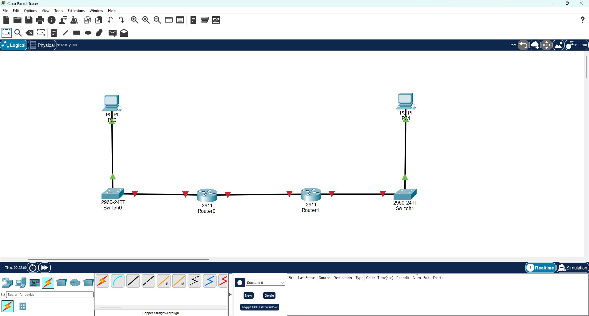
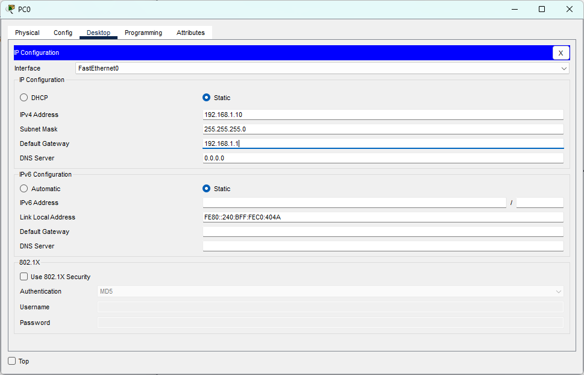
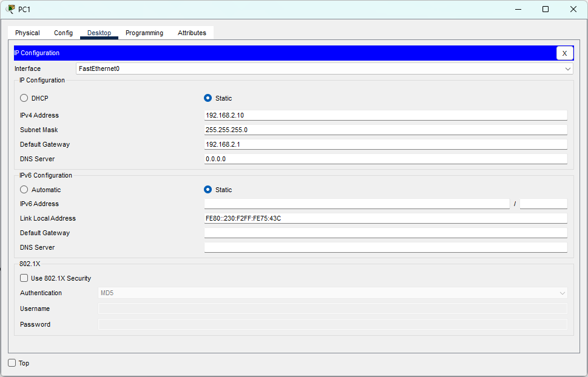
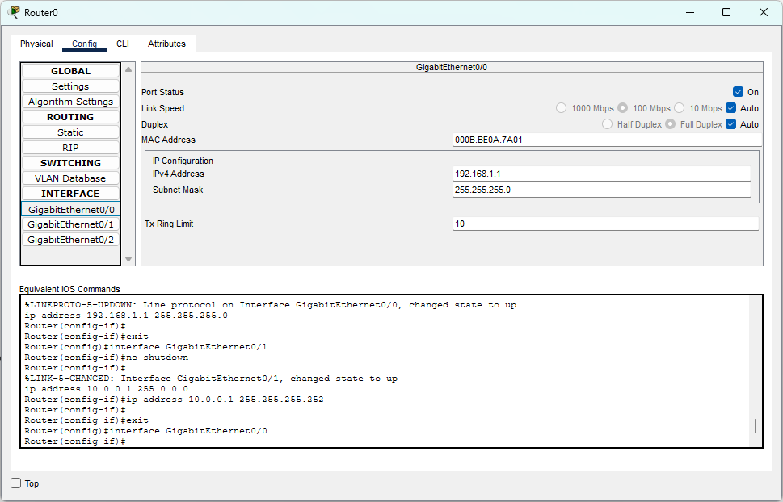
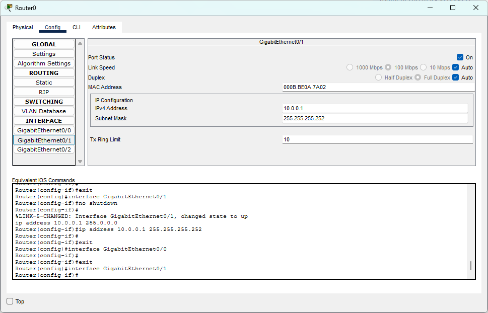
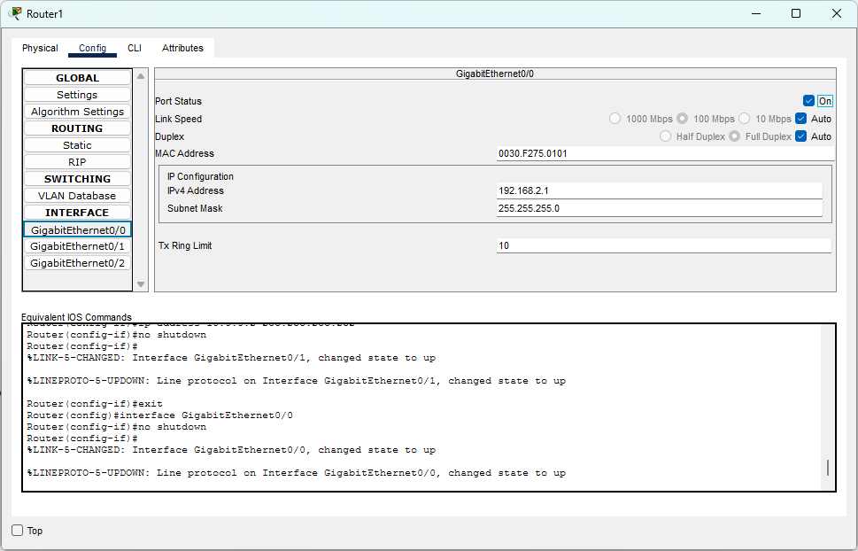
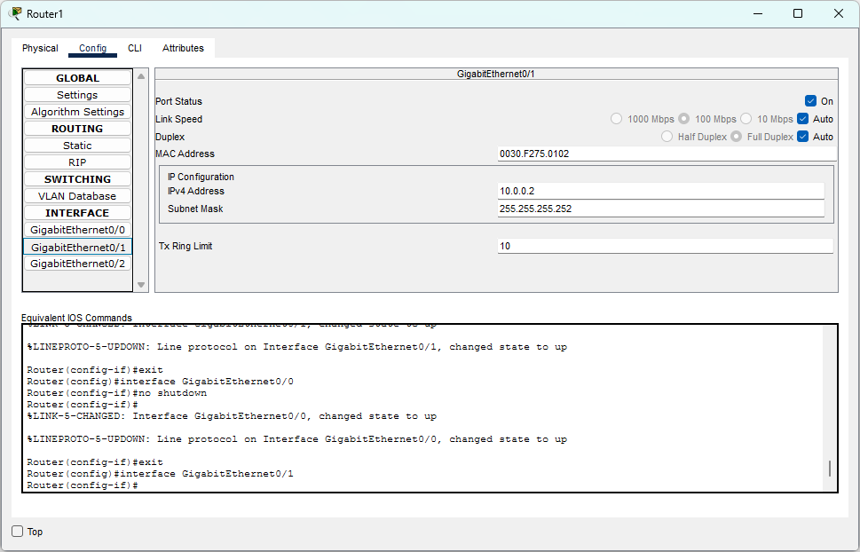
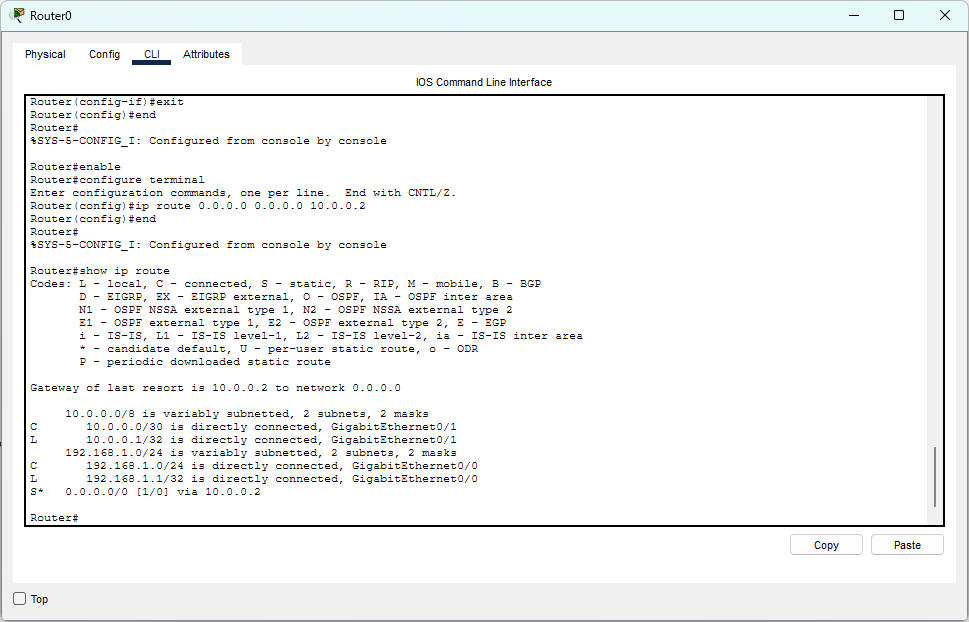
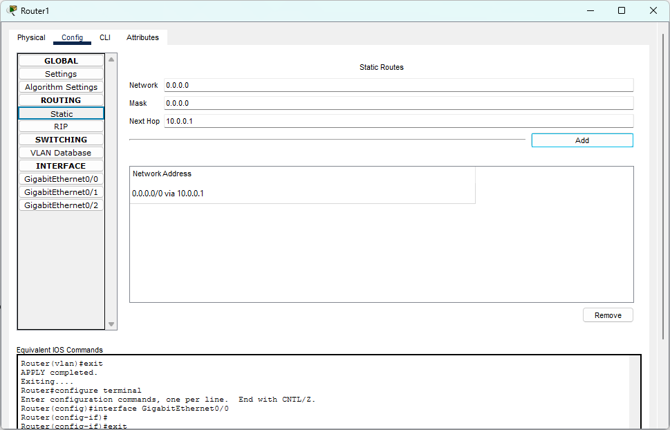
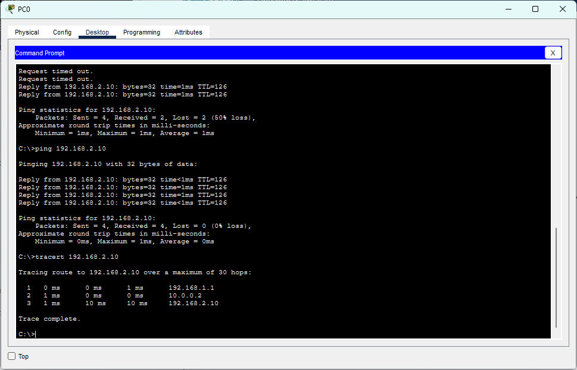

# CCNA Lab 05 — Default Routing

## 📌 Lab Overview

This lab was performed using **Cisco Packet Tracer** to understand how **Default Routing** is used to forward packets when a specific route to the destination is not available.

The network consists of two LANs connected through two routers.

* PC0 is located in the `192.168.1.0/24` network.
* PC1 is located in the `192.168.2.0/24` network.
* Router0 and Router1 are connected through the `10.0.0.0/30` network.

Default Routes were manually configured on both routers using the next-hop IP of the opposite router.

The connectivity was then verified using `ping` and `tracert`.

---

## 🎯 Objectives

* Configure IPv4 addressing on PCs and router interfaces
* Establish connectivity between two routers
* Understand Default Routing
* Understand the purpose of `0.0.0.0/0`
* Configure Default Routes manually
* Understand the Next-Hop IP address
* Understand Specific Route vs Default Route
* Verify the routing table using `show ip route`
* Test end-to-end connectivity using `ping`
* Verify the packet path using `tracert`

---

## 🖥️ Network Topology

PC0
 |
Switch0
 |
Router0
 | G0/1
 | 10.0.0.1
 |
 | 10.0.0.0/30
 |
 | 10.0.0.2
 | G0/0
Router1
 |
Switch1
 |
PC1

---

## 🌐 IP Addressing

| Device  | Interface          | IP Address   | Subnet Mask     | Default Gateway |
| ------- | ------------------ | ------------ | --------------- | --------------- |
| PC0     | FastEthernet0      | 192.168.1.10 | 255.255.255.0   | 192.168.1.1     |
| Router0 | GigabitEthernet0/0 | 192.168.1.1  | 255.255.255.0   | —               |
| Router0 | GigabitEthernet0/1 | 10.0.0.1     | 255.255.255.252 | —               |
| Router1 | GigabitEthernet0/0 | 10.0.0.2     | 255.255.255.252 | —               |
| Router1 | GigabitEthernet0/1 | 192.168.2.1  | 255.255.255.0   | —               |
| PC1     | FastEthernet0      | 192.168.2.10 | 255.255.255.0   | 192.168.2.1     |

---

## 🔌 Router-to-Router Connectivity

The routers were connected using the `10.0.0.0/30` network.

```text
Router0 G0/1 → 10.0.0.1/30
Router1 G0/0 → 10.0.0.2/30
```

The `/30` subnet provides two usable IP addresses, which are suitable for a point-to-point connection between two routers.

---

## 🛣️ Default Route Configuration

A Default Route is used when a router does not have a more specific route for the destination network.

The default route is represented by:

```text
0.0.0.0/0
```

### Router0

Router0 was configured to forward unmatched traffic toward Router1.

```text
ip route 0.0.0.0 0.0.0.0 10.0.0.2
```

Where:

```text
Destination: 0.0.0.0/0
Next-Hop IP: 10.0.0.2
```

### Router1

Router1 was configured to forward unmatched traffic toward Router0.

```text
ip route 0.0.0.0 0.0.0.0 10.0.0.1
```

Where:

```text
Destination: 0.0.0.0/0
Next-Hop IP: 10.0.0.1
```

---

## 🧠 Specific Route vs Default Route

A router prefers a more specific route when multiple routes match the destination.

For example:

```text
192.168.2.0/24 → Specific Route
0.0.0.0/0      → Default Route
```

If the destination is:

```text
192.168.2.10
```

the `192.168.2.0/24` route is preferred because it is more specific.

If there is no specific route for a destination, the router can use the Default Route.

---

## 📋 Routing Table Verification

The routing table was verified using:

```text
show ip route
```

### Router0

The routing table showed the configured Default Route:

```text
S* 0.0.0.0/0 [1/0] via 10.0.0.2
```

The `S*` indicates a **Static Default Route**.

### Router1

Router1 also showed its Default Route:

```text
0.0.0.0/0 via 10.0.0.1
```

This confirmed that Default Routing was configured on both routers.

---

## 🧪 End-to-End Connectivity Verification

After configuring the Default Routes, connectivity between PC0 and PC1 was tested.

From PC0:

```text
ping 192.168.2.10
```

The final ping result was:

```text
Packets: Sent = 4
Received = 4
Lost = 0 (0% loss)
```

This confirmed successful end-to-end connectivity between the two LANs.

---

## 🛣️ Packet Path Verification

The packet path was verified from PC0 using:

```text
tracert 192.168.2.10
```

The result showed:

```text
1    192.168.1.1
2    10.0.0.2
3    192.168.2.10
```

This confirmed the packet path:

```text
PC0
 ↓
Router0
 ↓
Router1
 ↓
PC1
```

The successful `tracert` demonstrated that the packet travelled through both routers before reaching the destination.

---

## 📸 Lab Evidence

### 1. Network Topology



---

### 2. PC0 IP Configuration



---

### 3. PC1 IP Configuration



---

### 4. Router0 G0/0 IP Configuration



---

### 5. Router0 G0/1 IP Configuration



---

### 6. Router1 G0/0 IP Configuration



---

### 7. Router1 G0/1 IP Configuration



---

### 8. Router0 Default Route



---

### 9. Router1 Default Route



---

### 10. Connectivity Verification



---

## 🧠 Key Concepts Learned

* Routing
* Routing Table
* Default Routing
* Default Route
* `0.0.0.0/0`
* Static Default Route
* Next-Hop IP
* Specific Route
* Longest Prefix Match
* IPv4 Addressing
* `/30` Point-to-Point Network
* `show ip route`
* ICMP Ping
* Traceroute

---

## 🛠️ Software Used

* Cisco Packet Tracer

---

## 📁 Lab Files

```text
Lab-05-Default-Routing/
│
├── Lab-05-Default-Routing.pkt
├── README.md
│
└── Screenshot/
    ├── 01-network-topology.png
    ├── 02-pc0-ip-configuration.png
    ├── 03-pc1-ip-configuration.png
    ├── 04-router0-g0-0-ip-configuration.png
    ├── 05-router0-g0-1-ip-configuration.png
    ├── 06-router1-g0-0-ip-configuration.png
    ├── 07-router1-g0-1-ip-configuration.png
    ├── 08-router0-default-route.png
    ├── 09-router1-default-route.png
    └── 10-connectivity-verification.png
```

---

## ✅ Lab Result

The lab successfully demonstrated **Default Routing between two different networks**.

The practical verified:

* IPv4 addressing
* Router interface configuration
* Router-to-Router connectivity
* Default Route configuration
* `0.0.0.0/0`
* Next-Hop IP
* Specific Route vs Default Route
* Routing table verification
* Successful end-to-end connectivity
* Packet path verification using `tracert`

---

## 👤 Author

**Sagen Saren**

```

