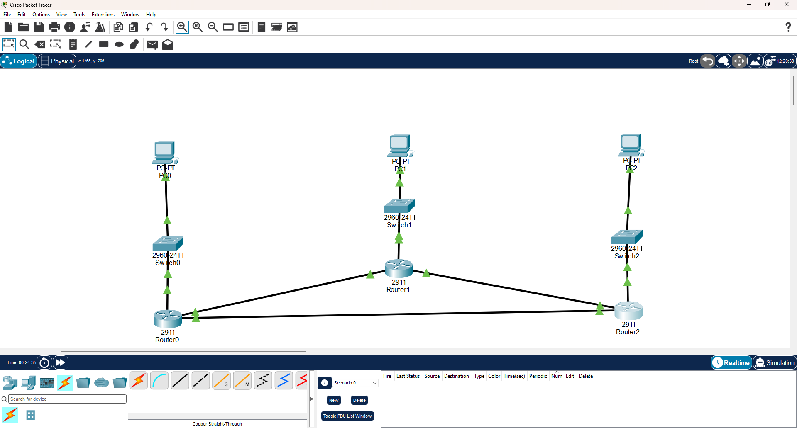
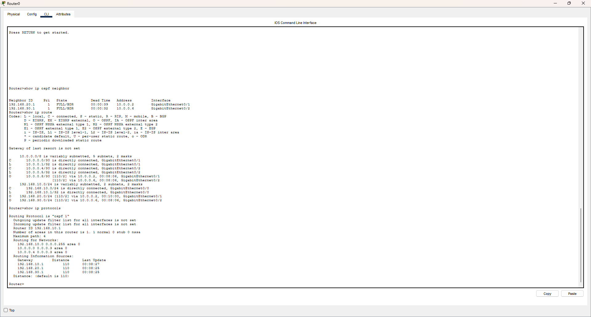
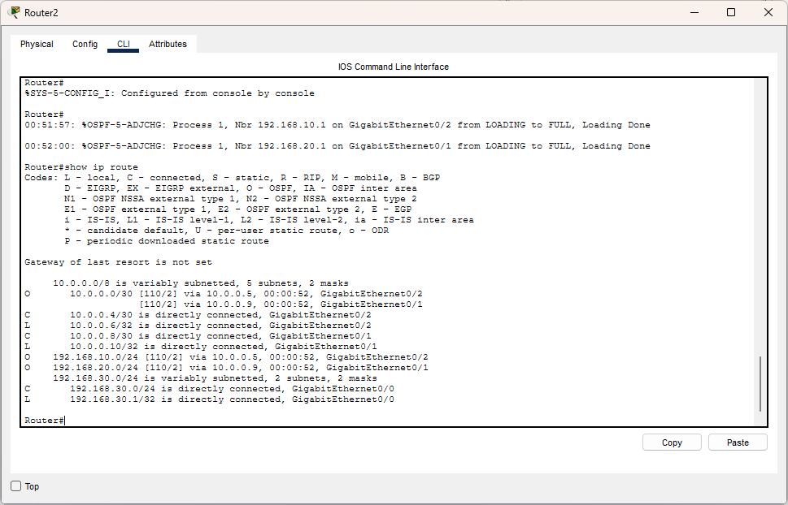
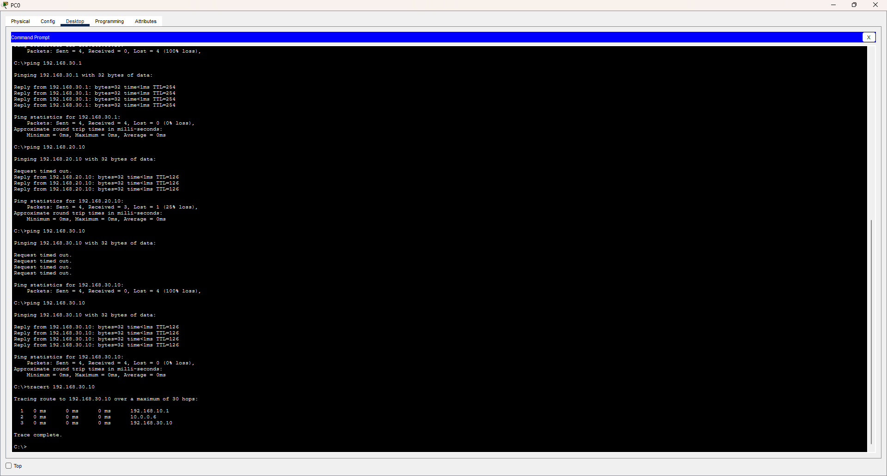
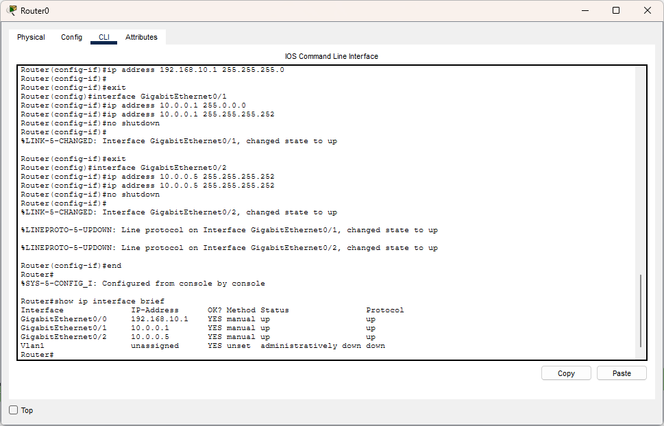
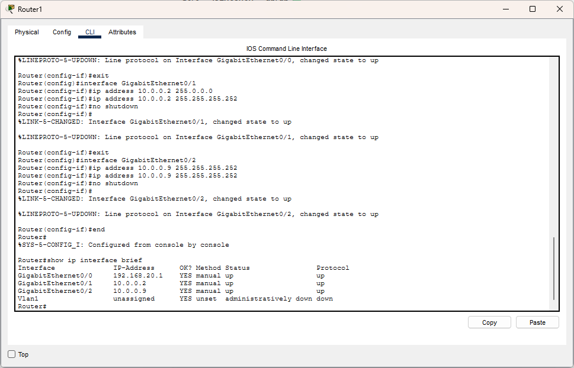
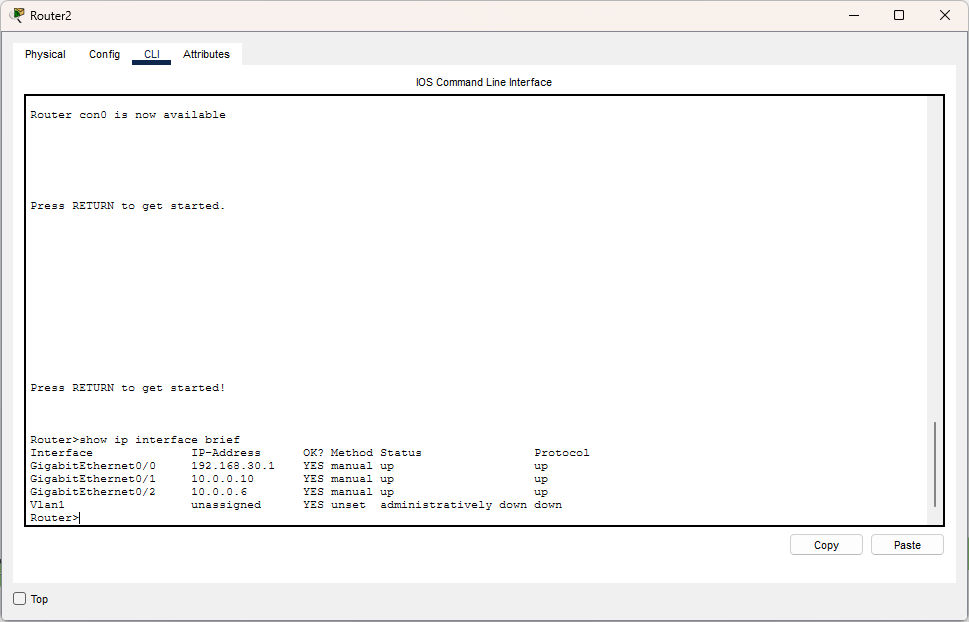

# CCNA Lab 06 — OSPF Routing

## 📌 Lab Overview

This lab was performed using **Cisco Packet Tracer** to understand **OSPF (Open Shortest Path First)** as a Dynamic Routing Protocol.

The network consists of three routers connected in a triangle topology. Each router is connected to a separate LAN containing a switch and a PC.

OSPF was configured on all three routers using **Area 0**. The routers formed OSPF neighbor relationships and exchanged routing information automatically.

Connectivity was verified using `show ip ospf neighbor`, `show ip route`, `ping`, and `tracert`.

---

## 🎯 Objectives

* Understand Dynamic Routing
* Understand OSPF
* Configure OSPF on multiple routers
* Understand OSPF Neighbor Relationships
* Understand OSPF Area 0
* Understand OSPF Network Commands
* Understand Wildcard Masks
* Understand OSPF Cost and Best Path Selection
* Verify OSPF neighbors
* Verify OSPF-learned routes
* Test end-to-end connectivity
* Verify the packet path using `tracert`

---

## 🖥️ Network Topology

The network contains three routers connected in a triangle topology.

```text
                 Router1
                /       \
               /         \
          Router0 ───── Router2
             |             |
          Switch0       Switch2
             |             |
            PC0           PC2

                 |
              Switch1
                 |
                PC1
````

The router-to-router links are:

```text
Router0 ↔ Router1
Router0 ↔ Router2
Router1 ↔ Router2
```



---

## 🌐 IP Addressing

### PC Addressing

| Device | IP Address    | Subnet Mask   | Default Gateway |
| ------ | ------------- | ------------- | --------------- |
| PC0    | 192.168.10.10 | 255.255.255.0 | 192.168.10.1    |
| PC1    | 192.168.20.10 | 255.255.255.0 | 192.168.20.1    |
| PC2    | 192.168.30.10 | 255.255.255.0 | 192.168.30.1    |

### Router Addressing

| Router  | Interface | IP Address   | Subnet Mask     |
| ------- | --------- | ------------ | --------------- |
| Router0 | G0/0      | 192.168.10.1 | 255.255.255.0   |
| Router0 | G0/1      | 10.0.0.1     | 255.255.255.252 |
| Router0 | G0/2      | 10.0.0.5     | 255.255.255.252 |
| Router1 | G0/0      | 192.168.20.1 | 255.255.255.0   |
| Router1 | G0/1      | 10.0.0.2     | 255.255.255.252 |
| Router1 | G0/2      | 10.0.0.9     | 255.255.255.252 |
| Router2 | G0/0      | 192.168.30.1 | 255.255.255.0   |
| Router2 | G0/1      | 10.0.0.10    | 255.255.255.252 |
| Router2 | G0/2      | 10.0.0.6     | 255.255.255.252 |

### Router-to-Router Networks

```text
Router0 ↔ Router1 = 10.0.0.0/30
Router0 ↔ Router2 = 10.0.0.4/30
Router1 ↔ Router2 = 10.0.0.8/30
```

---

## 🧠 What is Dynamic Routing?

In Static Routing, the administrator manually configures routes.

In Dynamic Routing, routers use routing protocols to learn network information from each other and automatically update their routing tables.

---

## 🛣️ What is OSPF?

**OSPF (Open Shortest Path First)** is a Dynamic Routing Protocol.

OSPF allows routers to exchange routing information, learn about the network topology, and calculate the best available path.

---

## 🤝 OSPF Neighbor Relationship

When OSPF is enabled on connected routers, they can form a **Neighbor Relationship**.

After becoming neighbors, routers exchange routing information.

```text
Router0 ←→ Router1
Router0 ←→ Router2
Router1 ←→ Router2
```

A successful OSPF adjacency is shown as:

```text
FULL
```

---

## 🌐 OSPF Area 0

All routers in this lab were configured in:

```text
Area 0
```

Area 0 is used as the OSPF backbone area.

---

## ⚙️ OSPF Configuration

### Router0

```text
router ospf 1
network 192.168.10.0 0.0.0.255 area 0
network 10.0.0.0 0.0.0.3 area 0
network 10.0.0.4 0.0.0.3 area 0
```

### Router1

```text
router ospf 1
network 192.168.20.0 0.0.0.255 area 0
network 10.0.0.0 0.0.0.3 area 0
network 10.0.0.8 0.0.0.3 area 0
```

### Router2

```text
router ospf 1
network 192.168.30.0 0.0.0.255 area 0
network 10.0.0.4 0.0.0.3 area 0
network 10.0.0.8 0.0.0.3 area 0
```

---

## 🎯 Understanding the OSPF Network Command

The OSPF network command has the following format:

```text
network <network-address> <wildcard-mask> area <area-id>
```

For example:

```text
network 10.0.0.8 0.0.0.3 area 0
```

Here:

```text
10.0.0.8   → Network Address
0.0.0.3    → Wildcard Mask
area 0     → OSPF Area
```

The wildcard mask is used to identify which interfaces/IP range should participate in OSPF.

---

## 🔍 Wildcard Mask

A wildcard mask is used with the OSPF `network` command to match IP addresses/interfaces.

For a `/24` network:

```text
Subnet Mask:    255.255.255.0
Wildcard Mask:  0.0.0.255
```

For a `/30` network:

```text
Subnet Mask:    255.255.255.252
Wildcard Mask:  0.0.0.3
```

The wildcard mask is the inverse of the subnet mask.

```text
255.255.255.252
        ↓
0.0.0.3
```

---

## 🧮 OSPF Cost and Best Path

OSPF uses **Cost** when selecting a path.

Generally, a path with a lower total cost is preferred.

Example:

```text
Path A = Cost 30
Path B = Cost 10
```

OSPF prefers:

```text
Path B
```

because its total cost is lower.

---

## 📋 OSPF Neighbor Verification

OSPF neighbors were verified using:

```text
show ip ospf neighbor
```

The routers successfully formed OSPF neighbor relationships.



---

## 📊 OSPF Routing Table Verification

The routing table was verified using:

```text
show ip route
```

Routes learned through OSPF are marked with:

```text
O
```

For example:

```text
O 192.168.10.0/24
O 192.168.20.0/24
O 10.0.0.0/30
```

`O` indicates that the route was learned through OSPF.



---

## 🧪 End-to-End Connectivity Verification

Connectivity between the networks was tested using `ping`.

From PC0:

```text
ping 192.168.30.10
```

The final result was:

```text
Packets: Sent = 4
Received = 4
Lost = 0 (0% loss)
```

This confirmed successful end-to-end connectivity between PC0 and PC2.

---

## 🛣️ Packet Path Verification

The packet path was verified using:

```text
tracert 192.168.30.10
```

The path was:

```text
1    192.168.10.1
2    10.0.0.6
3    192.168.30.10
```

This shows that the packet travelled:

```text
PC0
 ↓
Router0
 ↓
Router2
 ↓
PC2
```



---

## 📸 Lab Evidence

### 1. Network Topology


### 2. Router0 IP Configuration



### 3. Router1 IP Configuration



### 4. Router2 IP Configuration



### 5. OSPF Neighbor Verification


### 6. OSPF Routing Table


### 7. Connectivity Verification


---

## 🧠 Key Concepts Learned

* Dynamic Routing
* OSPF
* OSPF Neighbor Relationship
* OSPF Area 0
* Routing Information Exchange
* Network Topology
* SPF (Shortest Path First)
* OSPF Cost
* Best Path Selection
* Wildcard Mask
* OSPF Network Command
* OSPF Routing Table
* `show ip ospf neighbor`
* `show ip route`
* `ping`
* `tracert`

---

## 🛠️ Software Used

* Cisco Packet Tracer

---

## 📁 Lab Files

```text
Lab-06-OSPF-Routing/
│
├── Lab-06-OSPF-Routing.pkt
├── README.md
│
└── Screenshot/
    ├── 01-network-topology.png
    ├── 02-router0-ip-configuration.png
    ├── 03-router1-ip-configuration.png
    ├── 04-router2-ip-configuration.png
    ├── 05-ospf-neighbor-verification.png
    ├── 06-ospf-routing-table.png
    └── 07-connectivity-verification.png
```

---

## ✅ Lab Result

The lab successfully demonstrated **OSPF Dynamic Routing** using three routers.

The practical verified:

* Dynamic Routing
* OSPF configuration
* OSPF Neighbor Relationships
* Area 0
* Routing Information Exchange
* OSPF-learned routes
* Wildcard Masks
* OSPF Cost and Best Path Selection
* Routing Table Verification
* Successful End-to-End Connectivity
* Packet Path Verification using `tracert`

---

## 👤 Author

**Sagen Saren**
