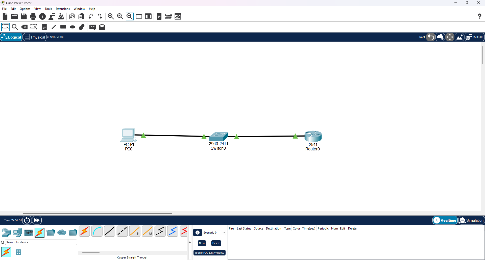
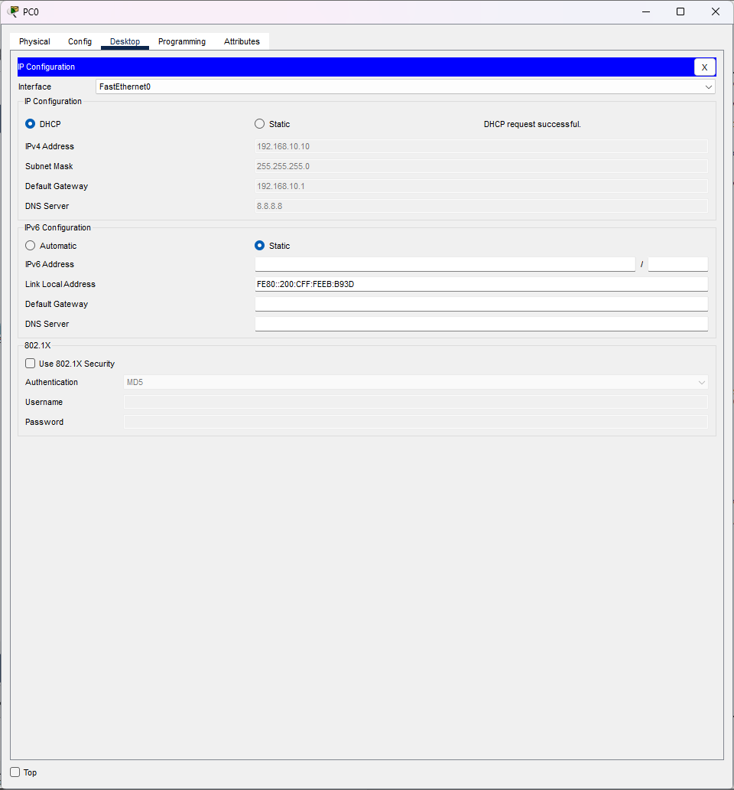
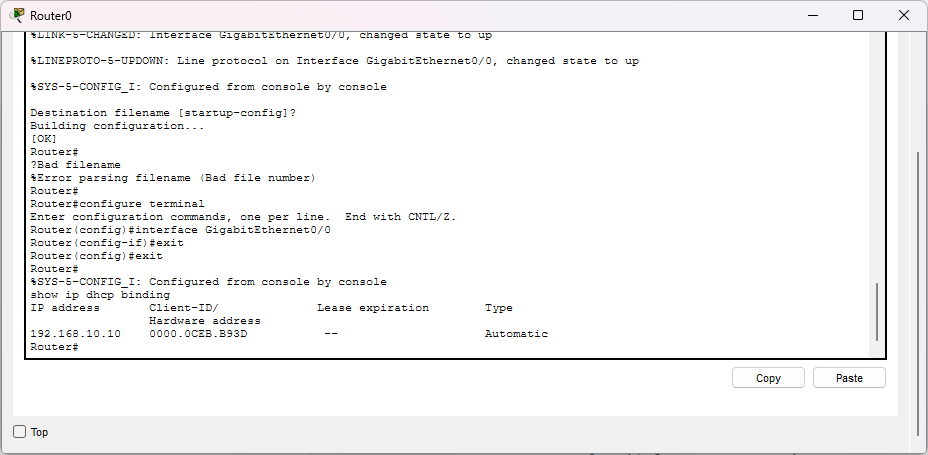
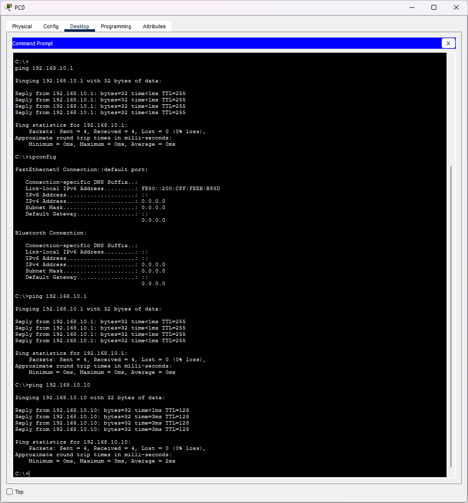
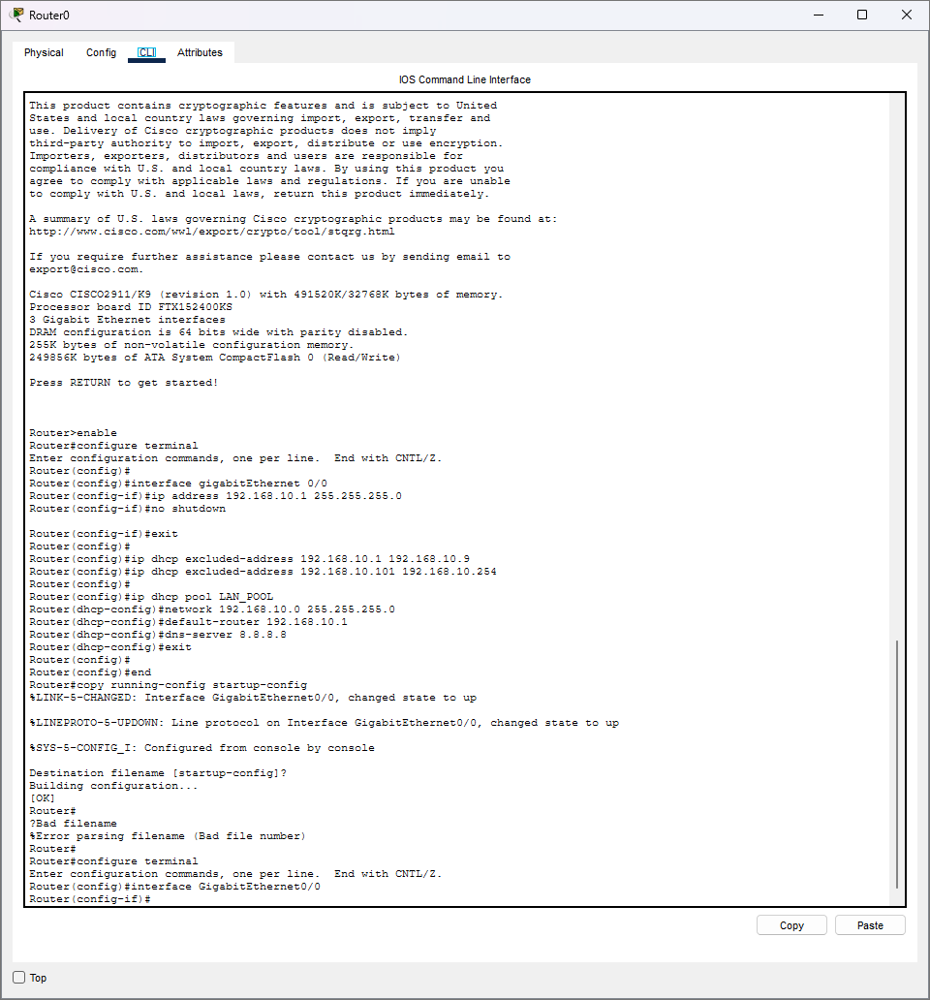

# CCNA Lab 07 — DHCP

## 📌 Lab Overview

This lab demonstrates the configuration and verification of **DHCP (Dynamic Host Configuration Protocol)** using Cisco Packet Tracer.

In this lab, Router0 is configured as a DHCP Server. The router automatically provides IP configuration to PC0.

The DHCP configuration includes:

- IP Address
- Subnet Mask
- Default Gateway
- DNS Server
- DHCP Address Pool
- Excluded IP Addresses

The configuration was verified using DHCP assignment, DHCP binding, and ping tests.

---

## 🎯 Objectives

- Understand DHCP
- Configure a Cisco router as a DHCP Server
- Create a DHCP Pool
- Configure the DHCP Network
- Configure the Default Gateway
- Configure the DNS Server
- Exclude specific IP addresses from the DHCP Pool
- Configure a PC as a DHCP Client
- Verify DHCP address assignment
- Verify DHCP bindings
- Test network connectivity

---

## 🖥️ Network Topology

The topology contains:

```text
PC0 ─── Switch0 ─── Router0
````



---

## 🌐 IP Addressing

### Router0

| Interface | IP Address   | Subnet Mask   |
| --------- | ------------ | ------------- |
| G0/0      | 192.168.10.1 | 255.255.255.0 |

### DHCP Network

```text
Network: 192.168.10.0/24
Gateway: 192.168.10.1
DHCP Range: 192.168.10.10 – 192.168.10.100
DNS Server: 8.8.8.8
```

---

## ⚙️ DHCP Configuration

Router0 was configured as a DHCP Server.

### Router0 Configuration

```text
enable
configure terminal

interface gigabitEthernet 0/0
ip address 192.168.10.1 255.255.255.0
no shutdown
exit

ip dhcp excluded-address 192.168.10.1 192.168.10.9
ip dhcp excluded-address 192.168.10.101 192.168.10.254

ip dhcp pool LAN_POOL
network 192.168.10.0 255.255.255.0
default-router 192.168.10.1
dns-server 8.8.8.8
exit

end
copy running-config startup-config
```

---

## 🧠 Understanding the Configuration

### DHCP Pool

```text
ip dhcp pool LAN_POOL
```

Creates a DHCP pool named `LAN_POOL`.

### Network

```text
network 192.168.10.0 255.255.255.0
```

Defines the network from which DHCP addresses will be assigned.

### Default Gateway

```text
default-router 192.168.10.1
```

Provides the Default Gateway information to DHCP clients.

### DNS Server

```text
dns-server 8.8.8.8
```

Provides the DNS Server address to DHCP clients.

### Excluded Addresses

```text
ip dhcp excluded-address 192.168.10.1 192.168.10.9
ip dhcp excluded-address 192.168.10.101 192.168.10.254
```

These addresses are excluded from DHCP assignment.

Therefore, the main DHCP assignment range is:

```text
192.168.10.10 – 192.168.10.100
```

---

## 🔄 DHCP DORA Process

DHCP uses the DORA process to assign an IP configuration to a client.

```text
Discover → Offer → Request → ACK
```

### 1. Discover

The client searches for an available DHCP Server.

### 2. Offer

The DHCP Server offers an IP configuration to the client.

### 3. Request

The client requests the offered configuration.

### 4. ACK

The DHCP Server confirms the configuration.

---

## 💻 DHCP Client Configuration

PC0 was configured to obtain its IP address automatically using DHCP.

The DHCP request was successful.

PC0 received:

```text
IP Address:      192.168.10.10
Subnet Mask:     255.255.255.0
Default Gateway: 192.168.10.1
DNS Server:      8.8.8.8
```



---

## 🔍 DHCP Verification

### DHCP Pool Verification

Command:

```text
show ip dhcp pool
```

This was used to verify the DHCP Pool configuration and available addresses.

### DHCP Binding Verification

Command:

```text
show ip dhcp binding
```

The router successfully created a DHCP lease:

```text
IP Address:       192.168.10.10
Type:              Automatic
```



---

## 🧪 Connectivity Verification

PC0 was tested against the Default Gateway:

```text
ping 192.168.10.1
```

The ping was successful:

```text
Packets: Sent = 4
Received = 4
Lost = 0
```

This confirms that PC0 can communicate with Router0.



---

## 📸 Lab Evidence

### 1. DHCP Topology


### 2. Router DHCP Configuration



### 3. DHCP Assignment


### 4. DHCP Binding


### 5. Connectivity Verification


---

## 🧠 Key Concepts Learned

* DHCP
* DHCP Client
* DHCP Server
* DHCP Pool
* Excluded Addresses
* DORA Process
* DHCP Discover
* DHCP Offer
* DHCP Request
* DHCP ACK
* Default Gateway through DHCP
* DNS Server through DHCP
* DHCP Binding
* Automatic IP Address Assignment
* DHCP Verification
* Network Connectivity Testing

---

## 🛠️ Software Used

* Cisco Packet Tracer

---

## 📁 Lab Files

```text
Lab-07-DHCP/
│
├── Lab-07-DHCP.pkt
├── README.md
│
└── Screenshot/
    ├── 01-dhcp-topology.png
    ├── 02-router-dhcp-config.png
    ├── 03-dhcp-successful.png
    ├── 04-dhcp-binding.png
    └── 05-dhcp-connectivity.png
```

---

## ✅ Lab Result

The DHCP lab was successfully completed.

Router0 was configured as a DHCP Server and successfully assigned an IP address to PC0.

The DHCP configuration was verified using DHCP binding and connectivity testing.

**Final Result: DHCP Successfully Configured and Verified ✅**

---

## 👤 Author

**Sagen Saren**

**3.** Screenshot folder-এর ৫টা file-এর নাম README-র মতো আছে কিনা মিলিয়ে নেবে।

তারপর আমাকে বলবে **`.pkt` আর screenshots upload হয়ে গেছে কিনা**—আমি exact commit message দিয়ে দেব।
